# Medro — Navegação e Permissões

## 1. Modelo de autenticação

Login próprio na tabela Dataverse **`Credenciaiss`** (`cr4a1_credenciais`). Não usa Azure AD para o usuário final.

Regra observada em `Login.OnSelect`:

```
LookUp(Credenciaiss, Usuário = caixausuario1.Text And Matrícula = caixasenha1.Text And xstatus = "Ativo")
```

Variáveis globais definidas no login: `varlogin` (usuário), `varsenha`, `varnome` (Título), `varfilial` (Filial).

### Campos de `Credenciaiss` usados como autorização

| Campo | Uso |
|---|---|
| `Usuário` / `varlogin` | identificador de login |
| `Matrícula` | senha |
| `xstatus` | `"Ativo"` habilita o acesso |
| `Título` | nome do colaborador (exibição, filtros de galeria) |
| `Filial` | São Luís, Aveiro, Barcarena, Parauapebas, São José dos Campos |
| `acesso_mod` | string com **tokens de módulo/ação** concatenados; testado com `"TOKEN" in acesso_mod` |
| `Acesso` | perfil textual (ex.: `"SSMA"`) |
| `1_Nivel`, `2_Nivel` | nível de produção (ex.: `"PRODUÇÃO PADRÃO"`, `"TESTE"`) |

### Tokens de `acesso_mod` encontrados no código

> `"TOKEN" in LookUp(Credenciaiss, varlogin = Usuário, acesso_mod)` — habilita telas/botões.

| Token | Ocorrências | Telas |
|---|--:|---|
| `_ROTA_MOT` | 15 | COD_GERENCIAMENTO |
| `_ROTA_AUX` | 14 | COD_GERENCIAMENTO |
| `_CAL_CAD` | 8 | Caldeiraria_Botao_Pendente, Caldeiraria_Pendentes_Servicos, Controle_Caldeiraria |
| `_DTI_LINK` | 5 | SELEC_COD |
| `_QRL_ALL` | 5 | QRCodeLaudos |
| `_OS_EDIT_HIST` | 4 | TelaInicial_Medro_Nova |
| `AVA` | 3 | Login, Login_1, SELEC_COD |
| `_G_LOG` | 3 | COD_GERENCIAMENTO, Hist+¦rico_check_SLZ |
| `QRL` | 2 | DepTecnico, SELEC_COD |
| `TER` | 2 | COD_GERENCIAMENTO, SELEC_COD |
| `_LOG_CHE` | 2 | SelecaoTrajeto |
| `_OS_PESQ` | 2 | TelaInicial_Medro_Nova |
| `_OS_REP` | 2 | TelaInicial_Medro_Nova |
| `_OS_SENHA` | 2 | Finalizar_Medro_Nova |
| `_TER_CAD` | 2 | Controle_Caldeiraria |
| `CAL` | 1 | SELEC_COD |
| `DPT` | 1 | SELEC_COD |
| `ESCOPO` | 1 | SELEC_COD |
| `FER` | 1 | SELEC_COD |
| `GER` | 1 | SELEC_COD |
| `INS` | 1 | AvaliacaoFinal |
| `OS` | 1 | SELEC_COD |
| `ROT` | 1 | SELEC_COD |
| `SPO` | 1 | SELEC_COD |
| `TES` | 1 | AvaliacaoFinal |
| `_AVA_LIB` | 1 | AvaliacaoFinal |
| `_DPT_REMOVE` | 1 | DepTecnico |
| `_G_CAD` | 1 | COD_GERENCIAMENTO |
| `_G_PCP` | 1 | COD_GERENCIAMENTO |
| `_OS_EDOS` | 1 | TelaInicial_Medro_Nova |
| `_OS_HG` | 1 | TelaInicial_Medro_Nova |
| `_OS_REMOVE` | 1 | TelaInicial_Medro_Nova |
| `_PCP_RQ` | 1 | SELEC_COD |

**Legenda provável dos tokens:** `OS` = módulo OS Medro; `GER` = Gerenciamento/PCP; `AVA` = Avaliação Final; `CAL` = Caldeiraria; `DPT` = Departamento Técnico; `ESCOPO` = Escopo de Manutenção; `FER` = Ferramentaria; `INS` = Inspeção de Qualidade; `QRL` = QR Code / Laudos; `ROT` = Rotas/Trajetos; `SPO` = Serviços Externos Portugal; `TER` = Terceirizados; `TES` = Testes/Ensaio; `_AVA_LIB` = Avaliação: liberar; `_CAL_CAD` = Caldeiraria: cadastrar; `_DPT_REMOVE` = DPT: remover; `_DTI_LINK` = DPT: gerar link; `_G_CAD` = Gerência: cadastro; `_G_LOG` = Gerência: log; `_G_PCP` = Gerência: PCP; `_LOG_CHE` = Login checklist; `_OS_EDOS` = OS: editar OS; `_OS_HG` = OS: histórico; `_OS_REP` = OS: reprovar; `_OS_SENHA` = OS: senha; `_OS_EDIT_HIST` = OS: editar histórico; `_PCP_RQ` = PCP: requisição; `_TER_CAD` = Terceirizados: cadastrar; `_ROTA_MOT` = Rota: motorista; `_ROTA_AUX` = Rota: auxiliar

## 2. Roteamento pós-login

`Login` → `1_Menu`. A partir do menu, o botão **Medro** roteia por `acesso_mod` / nível / filial:

- token `SELEC_COD` em `acesso_mod` **ou** nível `PRODUÇÃO PADRÃO`+`TESTE` → `SELEC_COD` (hub principal)
- `Filial = "São Luís"` e `Acesso = "SSMA"` → `Seleção_trajeto_SSMA`
- botão **RDS** → `Menu_RDS`; botão **Relatório** → `Relatorio`
- `SELEC_COD` é o hub que abre os módulos (15 destinos)

## 3. Grafo de navegação (Navigate)

```mermaid
graph LR
  1_Menu[1_Menu] --> Login[Login]
  1_Menu[1_Menu] --> Login_1[Login_1]
  1_Menu[1_Menu] --> Menu_RDS[Menu_RDS]
  1_Menu[1_Menu] --> Relatorio[Relatorio]
  1_Menu[1_Menu] --> SELEC_COD[SELEC_COD]
  1_Menu[1_Menu] --> Sele__o_trajeto_SSMA[Seleção_trajeto_SSMA]
  1_Menu[1_Menu] --> Vota__oCIPA[VotaçãoCIPA]
  AvaliacaoFinal[AvaliacaoFinal] --> GaleriaPeritagem[GaleriaPeritagem]
  AvaliacaoFinal[AvaliacaoFinal] --> HistoricoAvalFinais[HistoricoAvalFinais]
  AvaliacaoFinal[AvaliacaoFinal] --> InspecQuali[InspecQuali]
  AvaliacaoFinal[AvaliacaoFinal] --> LiberarEnsaio[LiberarEnsaio]
  AvaliacaoFinal[AvaliacaoFinal] --> SELEC_COD[SELEC_COD]
  Balanceamento_Pendentes[Balanceamento_Pendentes] --> Caldeiraria_Pendentes_Servicos[Caldeiraria_Pendentes_Servicos]
  COD_GERENCIAMENTO[COD_GERENCIAMENTO] --> Exportar_CheckList[Exportar_CheckList]
  COD_GERENCIAMENTO[COD_GERENCIAMENTO] --> Sele__o_trajeto_SSMA[Seleção_trajeto_SSMA]
  COD_GERENCIAMENTO[COD_GERENCIAMENTO] --> TelaPCP_SLZ[TelaPCP_SLZ]
  Caldeiraria_Botao_Pendente[Caldeiraria_Botao_Pendente] --> Balanceamento_Pendentes[Balanceamento_Pendentes]
  Caldeiraria_Botao_Pendente[Caldeiraria_Botao_Pendente] --> Caldeiraria_Pendentes_OS[Caldeiraria_Pendentes_OS]
  Caldeiraria_Botao_Pendente[Caldeiraria_Botao_Pendente] --> Caldeiraria_Pendentes_Pe_as[Caldeiraria_Pendentes_Peças]
  Caldeiraria_Botao_Pendente[Caldeiraria_Botao_Pendente] --> Controle_Caldeiraria[Controle_Caldeiraria]
  Caldeiraria_Hist_rico[Caldeiraria_Histórico] --> Caldeiraria_Pendentes_Servicos[Caldeiraria_Pendentes_Servicos]
  Caldeiraria_ListadePecas[Caldeiraria_ListadePecas] --> Caldeiraria_Pendentes_Servicos[Caldeiraria_Pendentes_Servicos]
  Caldeiraria_Pendentes_OS[Caldeiraria_Pendentes_OS] --> Caldeiraria_Pendentes_Servicos[Caldeiraria_Pendentes_Servicos]
  Caldeiraria_Pendentes_Pe_as[Caldeiraria_Pendentes_Peças] --> Caldeiraria_Pendentes_Servicos[Caldeiraria_Pendentes_Servicos]
  ControleTerceirizado[ControleTerceirizado] --> HistoricoTerceir[HistoricoTerceir]
  ControleTerceirizado[ControleTerceirizado] --> NovoRegistroTerceir[NovoRegistroTerceir]
  ControleTerceirizado[ControleTerceirizado] --> PendentesdeRetorno[PendentesdeRetorno]
  ControleTerceirizado[ControleTerceirizado] --> SELEC_COD[SELEC_COD]
  Controle_Caldeiraria[Controle_Caldeiraria] --> Caldeiraria_Botao_Pendente[Caldeiraria_Botao_Pendente]
  Controle_Caldeiraria[Controle_Caldeiraria] --> Caldeiraria_Hist_rico[Caldeiraria_Histórico]
  Controle_Caldeiraria[Controle_Caldeiraria] --> Caldeiraria_ListadePecas[Caldeiraria_ListadePecas]
  Controle_Caldeiraria[Controle_Caldeiraria] --> Caldeiraria_Novo[Caldeiraria_Novo]
  Controle_Caldeiraria[Controle_Caldeiraria] --> SELEC_COD[SELEC_COD]
  DepTecnico[DepTecnico] --> QRCodeLaudos[QRCodeLaudos]
  DepTecnico[DepTecnico] --> SELEC_COD[SELEC_COD]
  EscopoDeManuten[EscopoDeManuten] --> SELEC_COD[SELEC_COD]
  Exportar_CheckList[Exportar_CheckList] --> COD_GERENCIAMENTO[COD_GERENCIAMENTO]
  GaleriaPeritagem[GaleriaPeritagem] --> AvaliacaoFinal[AvaliacaoFinal]
  GaleriaPeritagem[GaleriaPeritagem] --> EnsaioTemporizado[EnsaioTemporizado]
  GaleriaPeritagem[GaleriaPeritagem] --> PeritagemFin_opicional[PeritagemFin_opicional]
  GerarLink_DPT[GerarLink_DPT] --> SELEC_COD[SELEC_COD]
  HIst_ricoServAVR[HIstóricoServAVR] --> Servi_osExternos[ServiçosExternos]
  HistoricoAvalFinais[HistoricoAvalFinais] --> PCP_ANTIGO[PCP_ANTIGO]
  HistoricoTerceir[HistoricoTerceir] --> ControleTerceirizado[ControleTerceirizado]
  HistoricoTerceir[HistoricoTerceir] --> HistoricoPendentes[HistoricoPendentes]
  Hist_rico_check_SLZ[Histórico_check_SLZ] --> Checklist_veicular_slz_View[Checklist_veicular_slz_View]
  Hist_rico_check_SLZ[Histórico_check_SLZ] --> Exportar_CheckList[Exportar_CheckList]
  Hist_rico_check_SLZ[Histórico_check_SLZ] --> SelecaoTrajeto[SelecaoTrajeto]
  InspecQuali[InspecQuali] --> FormInspec[FormInspec]
  Login[Login] --> AvaliacaoFinal[AvaliacaoFinal]
  Login_1[Login_1] --> AvaliacaoFinal[AvaliacaoFinal]
  Menu_RDS[Menu_RDS] --> Historico_RDS[Historico_RDS]
  Menu_RDS[Menu_RDS] --> Req_RDS[Req_RDS]
  PendentesdeRetorno[PendentesdeRetorno] --> AtualizacaoPendentes[AtualizacaoPendentes]
  PendentesdeRetorno[PendentesdeRetorno] --> ControleTerceirizado[ControleTerceirizado]
  QRCodeLaudos[QRCodeLaudos] --> SELEC_COD[SELEC_COD]
  Rel_Balanceamento[Rel_Balanceamento] --> SELEC_COD[SELEC_COD]
  Rel_Foto_Escolha[Rel_Foto_Escolha] --> Rel_Foto_Lista[Rel_Foto_Lista]
  Rel_Foto_Escolha[Rel_Foto_Escolha] --> Rel_Foto_Lista_PC[Rel_Foto_Lista_PC]
  Rel_Foto_Escolha[Rel_Foto_Escolha] --> Rel_Foto_parametro[Rel_Foto_parametro]
  Rel_Foto_Escolha[Rel_Foto_Escolha] --> SELEC_COD[SELEC_COD]
  Rel_Foto_Lista[Rel_Foto_Lista] --> Rel_Foto_Escolha[Rel_Foto_Escolha]
  Rel_Foto_Lista_PC[Rel_Foto_Lista_PC] --> Rel_Foto_Escolha[Rel_Foto_Escolha]
  Rel_Foto_Per[Rel_Foto_Per] --> Login_1[Login_1]
  Rel_Foto_Per[Rel_Foto_Per] --> Rel_Foto_parametro[Rel_Foto_parametro]
  Rel_Foto_parametro[Rel_Foto_parametro] --> Login[Login]
  Rel_Foto_parametro[Rel_Foto_parametro] --> Login_1[Login_1]
  Rel_Foto_parametro[Rel_Foto_parametro] --> Rel_Foto_Escolha[Rel_Foto_Escolha]
  Rel_Foto_parametro[Rel_Foto_parametro] --> Rel_Foto_Per[Rel_Foto_Per]
  Requisi__o_RDS[Requisição RDS] --> T_Ferramentaria[T_Ferramentaria]
  Requisi__o_PCP[Requisição_PCP] --> SELEC_COD[SELEC_COD]
  SELEC_COD[SELEC_COD] --> AvaliacaoFinal[AvaliacaoFinal]
  SELEC_COD[SELEC_COD] --> COD_GERENCIAMENTO[COD_GERENCIAMENTO]
  SELEC_COD[SELEC_COD] --> ControleTerceirizado[ControleTerceirizado]
  SELEC_COD[SELEC_COD] --> Controle_Caldeiraria[Controle_Caldeiraria]
  SELEC_COD[SELEC_COD] --> DepTecnico[DepTecnico]
  SELEC_COD[SELEC_COD] --> EntradaTarefa[EntradaTarefa]
  SELEC_COD[SELEC_COD] --> EscopoDeManuten[EscopoDeManuten]
  SELEC_COD[SELEC_COD] --> GerarLink_DPT[GerarLink_DPT]
  SELEC_COD[SELEC_COD] --> QRCodeLaudos[QRCodeLaudos]
  SELEC_COD[SELEC_COD] --> Rel_Balanceamento[Rel_Balanceamento]
  SELEC_COD[SELEC_COD] --> Rel_Foto_Escolha[Rel_Foto_Escolha]
  SELEC_COD[SELEC_COD] --> Requisi__o_PCP[Requisição_PCP]
  SELEC_COD[SELEC_COD] --> SelecaoTrajeto[SelecaoTrajeto]
  SELEC_COD[SELEC_COD] --> T_Ferramentaria[T_Ferramentaria]
  SELEC_COD[SELEC_COD] --> TelaInicial_Medro_Nova[TelaInicial_Medro_Nova]
  SelecaoTrajeto[SelecaoTrajeto] --> Checklist_veicular_slz[Checklist_veicular_slz]
  SelecaoTrajeto[SelecaoTrajeto] --> Controle_Caldeiraria[Controle_Caldeiraria]
  SelecaoTrajeto[SelecaoTrajeto] --> Hist_ricoTrajeto[HistóricoTrajeto]
  SelecaoTrajeto[SelecaoTrajeto] --> Hist_rico_check_SLZ[Histórico_check_SLZ]
  SelecaoTrajeto[SelecaoTrajeto] --> SELEC_COD[SELEC_COD]
  SelecaoTrajeto[SelecaoTrajeto] --> TelaTrajetos[TelaTrajetos]
  SelecaoTrajeto[SelecaoTrajeto] --> TrajetoFinal[TrajetoFinal]
  Sele__o_trajeto_SSMA[Seleção_trajeto_SSMA] --> ImprimirSSMA[ImprimirSSMA]
  T_Ferramentaria[T_Ferramentaria] --> T_Ferramentaria_Banco[T_Ferramentaria_Banco]
  T_Ferramentaria[T_Ferramentaria] --> T_Ferramentaria_Checklist[T_Ferramentaria_Checklist]
  T_Ferramentaria[T_Ferramentaria] --> T_Ferramentaria_FerrPorSetor[T_Ferramentaria_FerrPorSetor]
  T_Ferramentaria[T_Ferramentaria] --> T_Ferramentaria_historic[T_Ferramentaria_historic]
  TelaInicial_Medro_Nova[TelaInicial_Medro_Nova] --> EdicaoOS_Medro[EdicaoOS_Medro]
  TelaInicial_Medro_Nova[TelaInicial_Medro_Nova] --> Entrada_Medro_Nova[Entrada_Medro_Nova]
  TelaInicial_Medro_Nova[TelaInicial_Medro_Nova] --> Finalizar_Medro_Nova[Finalizar_Medro_Nova]
  TelaInicial_Medro_Nova[TelaInicial_Medro_Nova] --> Gestao_Pendencias_Medro[Gestao_Pendencias_Medro]
  TelaInicial_Medro_Nova[TelaInicial_Medro_Nova] --> SELEC_COD[SELEC_COD]
```



## 4. Telas sem entrada por Navigate (entrada por menu, deep-link ou órfãs)

- `1_Menu`
- `Atendimento`
- `Documentos_trajeto SLZ`
- `HIstóricoServAVR`
- `HistoricoTarefa_PRP`
- `Novo_CheckList_Veicular`
- `PeritagemFin_Temporizado`
- `Requisição RDS`
- `Screen1`
- `Screen2`
- `TelaPCP_SLZ_1`
